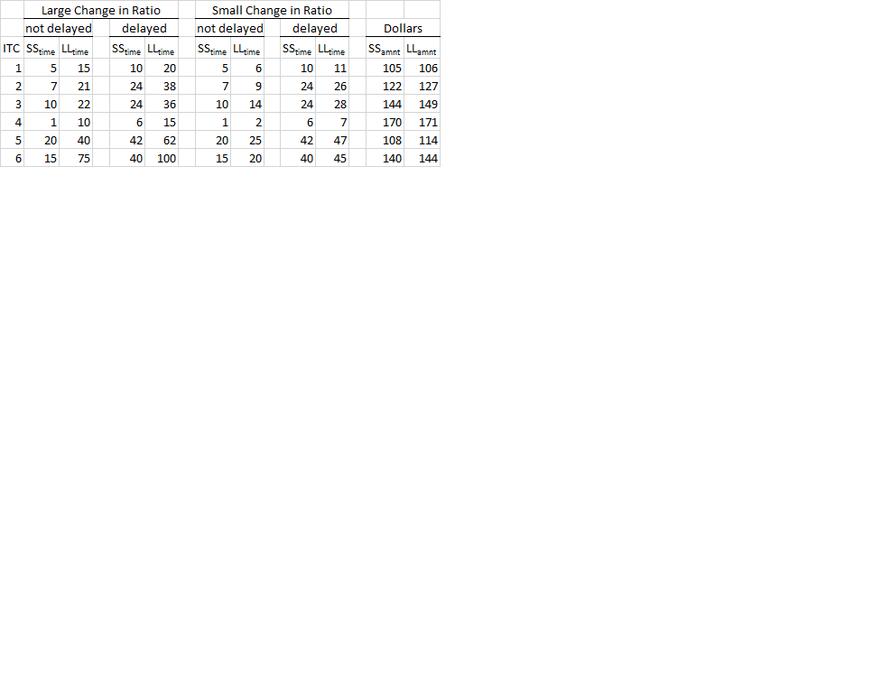

```{r, echo=FALSE, message = FALSE}
setwd("/git_repositories/timeratios/wave_10dec/")
library(knitr)
library(xtable)
source("load_packages.R")
rm(list = ls())
load("analyzed_data/analyzed_data.Rdata")

opts_knit$set(echo=FALSE, message = FALSE, warning = FALSE)
```

# Study 1: Does a large change in temporal ratios alter similarity and choice. 


## Method

As a requirement for course credit, `r nrow(timerat)` Rutgers undergradutates took part in this study. 
This study was taken along with six other, unrelated, studies which will not be reported furter. 
After participants completed informed consent, they were assigned to one of two temporal ratio change conditions: 1) Small temporal ratio change and 2) Large temporal ratio change. 
Stimuli can be seen in Table [].



Participants then made unlikeness judgements between two times on a slider bar with a range of 0 - 100. 
Specifcally they were told: "For the first part of this study we will ask you how "unlike" you perceive two different points in time to be.
You will be given a slider bar with:
Not at all Unlike each other on the left and 
Completely Unlike each other on on the right"


Next within the ratio change condition the the delayed or not delayed block was shown first followed by the other block. 
This was done to minimize the chance that related choices were shown sequentially. 
Within each block choices were presented in a random order. 

After completing 12 unlikeness judgments participants completed an unrelated task which will not be reported further. 
Next participants completed 12 intertemporal choice questions. 

Similar to the unlikeness judgments participants either saw the delayed or not delayed block of choices first. 
Once again within a block choices were randomly presented to subjects. 
The monetary amounts for the choices can be seen in the last two rows of Table [].


## Results 

### Unlikeness Judgments

First, for each choice we subtracted the "not delayed"" unlikeness judgment from the "delayed" unlikeness judgment to calculate the unlikeness difference measure. 
Figure [] shows the unlikeness difference measure for each ITC id for both the large and small ratio temporal ratio change conditions along with 95% confidence intervals.

```{r, echo=FALSE, message = FALSE}
ggplot(diss1_sum, aes(x = id_pair, y = mean_dissdiff, fill = ratcng, color = ratcng)) +
  geom_bar(stat="identity", position = "dodge") +
  geom_errorbar(aes(ymin = lower, ymax = upper), position = "dodge")

```


We also ran non-paired t tests to check for significant differences which can be seen in Table[].
There are no significant differences between the large and small ratio changes for any id pair. 

```{r, echo=FALSE, message = FALSE}
diss_t_tests
```


### ITC Choices

Below are the percentage of larger later choices for each of the ITC ids in both the delayed and not delayed conditions.
The top panel is the large temporal ratio change condition and the bottom panel is the small temporal ratio change condition.

```{r, echo=FALSE, message = FALSE}
ggplot(itc_sum_id, aes(x = id_pair, y = estimate, group = delayed, fill = delayed)) +
  geom_bar(stat = "identity", position = "dodge") +
  geom_errorbar(aes(ymax = conf.high, ymin = conf.low), position = "dodge") +
  facet_grid(ratcng ~ .)
```


Next, for each intertemporal choice id, we ran a logistic regression predicting choice with 0 = Smaller Sooner and 1 = Larger Later. 
The indepent variables were whether or not the choice was delayed, the change in temporal ratio, and the interaction between the two. 
The figure below shows the regression coefficients along with the 95% CI.

```{r, echo=FALSE, message = FALSE}
ggplot(itc_glms_sub, aes(x = id_pair, y = estimate, group = term,  fill = term)) +
  geom_bar(stat = "identity", position = "dodge") +
  geom_errorbar(aes(ymax = upper, ymin = lower), position = "dodge")
  
```


As expected, regardless of delay, people are significantly more likely to choose the larger later option when the ratio change is small.
There is no effect of whether or not the the choice was delayed. 
Futher there was no interaction between delayed and the type of ratio change.


These results were confirmed by an omnibus logistic regression predicting choice with delay type, ratio change type, each unique intertemporal choice, and all possible interactions. 
As seen by the ANOVA below.
There is a main effect of temporal ratio change and of each unique intertemporal choice, but no other effects approach significance. 

```{r, echo=FALSE, message = FALSE}
Anova(all_int_glm, type = 3)

```

